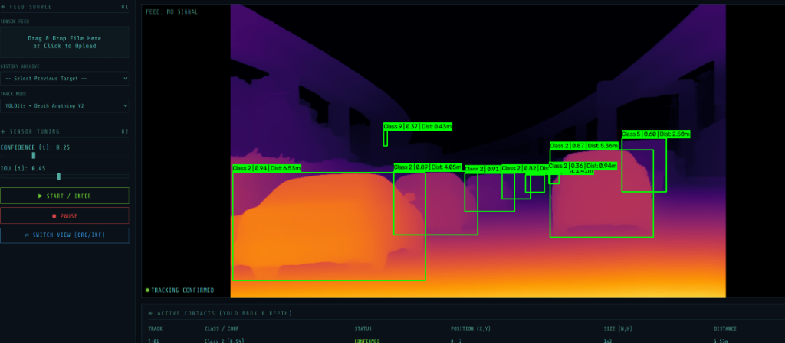

# Low-Compute YOLO Depth Inference Platform (低算力 YOLO 深度推論平台)

[](https://www.python.org/)
[](https://www.intel.com/content/www/us/en/developer/tools/openvino-toolkit/overview.html)
[](https://fastapi.tiangolo.com/)

<p align="center">
  
</p>

本專案為針對**低算力環境（邊緣運算 / CPU 平台）**高度最佳化的多模態視覺推論平台。結合 **YOLOv11 2D 物件偵測** 與 **Depth Anything V2 單眼深度估計**，透過相機幾何模型將 2D 偵測框與深度資訊即時融合成 3D 空間目標並換算物理距離。全平台基於 **OpenVINO** 進行模型量化與低算力 CPU 推論加速，並配備賽博龐克風格的 **FastAPI 互動式 Web 操作介面** 與命令列批次處理工具。

---

## 核心功能特色

1. **多模態感知融合 (2D Detection + Monocular Depth)**
   - 使用 YOLOv11 進行高精準度 2D 物件偵測與分類。
   - 使用 Depth Anything V2 進行單眼深度估計，取得每像素深度分佈。
   - 融合相機內參 (Camera Intrinsics) 換算 3D 空間中心座標與物理距離 (Distance)。

2. **OpenVINO 高效能加速**
   - 雙模型均轉換為 OpenVINO IR 格式，支援 CPU 高速並行運算與推論預熱 (Warm-up)。

3. **設計模式與架構解耦 (Factory Method Pattern)**
   - 採用工廠方法解耦 `DetectorFactory`、`DepthEstimatorFactory` 與 `PipelineFactory`。
   - 模組化架構方便未來擴充其他偵測或深度演算法（如 MiDaS 等）。

4. **互動式 Web 視覺化平台**
   - 支援拖曳/點擊上傳圖片與影片。
   - 即時調整 Confidence 與 IOU 門檻值並重新推論。
   - 原圖 / 深度推論圖即時切換視圖 (Switch View)。
   - 即時目標清單表格（顯示 Track ID、狀態、座標、大小、距離、類別與信心度）。
   - 歷史紀錄回溯功能。

---

## 專案目錄結構

```text
Low-Compute-YOLO-Depth-Inference-Platform/
├── assets/                 # 視覺預覽與展示圖片
│   └── demo.png            # Web 平台推論介面展示圖
├── config/                 # 組態設定檔目錄
├── data_store/             # Web 平台歷史紀錄儲存區
├── output/                 # 推論結果輸出目錄 (圖片/影片)
├── samples/                # 測試範例檔案目錄
├── scripts/
│   └── export_openvino.py  # 模型下載與 OpenVINO 格式自動轉換腳本
├── src/
│   ├── detectors/          # 物件偵測器模組 (YOLO / BaseDetector / Factory)
│   ├── depth_estimators/   # 深度估計模組 (DepthAnything / Factory)
│   ├── fusion/             # 3D 空間與相機幾何融合模組
│   ├── pipeline/           # 影像與影片推論流程管線
│   ├── visualization/      # 繪圖與深度圖著色視覺化模組
│   ├── main.py             # CLI 參數化推論入口
│   └── __init__.py
├── static/                 # Web 前端靜態資源 (CSS, JS)
├── templates/              # Web 前端模板 (HTML)
├── test1/                  # 批次圖片測試目錄
├── test2/                  # 批次影片測試目錄
├── uploads/                # Web 平台使用者上傳暫存目錄
├── weights/                # 模型權重目錄 (OpenVINO IR 格式)
│   ├── depth_anything/     # Depth Anything V2 權重與設定
│   └── yolo11s_openvino_model/ # YOLOv11s OpenVINO 權重
├── main.py                 # 自動掃描 test1/test2 批次推論腳本
├── web_app.py              # FastAPI Web 應用程式後端伺服器
├── requirements.txt        # 專案相依套件清單
└── README.md               # 專案說明文件
```

---

## 環境建置指南

### 1. 建立 Python 虛擬環境

建議使用 Python 3.10 環境：

**使用 conda / micromamba：**
```bash
micromamba create -y -n YoloPlatform python=3.10
micromamba activate YoloPlatform
```

**或使用 Python 原生 venv：**
```bash
python -m venv .venv
# Linux / macOS / WSL
source .venv/bin/activate
# Windows PowerShell
.\.venv\Scripts\Activate.ps1
```

---

### 2. 安裝相依套件

```bash
pip install -r requirements.txt
```

> [!IMPORTANT]
> **套件版本注意事項**：
> `transformers` 建議維持 `< 5.0`（例如 `4.40.x` ~ `4.57.x`），以確保與 PyTorch 2.4+ CPU 版本的相容性，避免模型轉換時發生找不到 Torchvision 的異常。

---

### 3. 下載與轉換模型權重 (OpenVINO IR)

專案內建一鍵模型轉換腳本，執行後會自動由 Hugging Face 及 Ultralytics 下載預訓練權重，並匯出為 OpenVINO 模型格式存放至 `weights/` 資料夾：

```bash
python scripts/export_openvino.py
```

轉換完成後，`weights/` 資料夾內將包含：
- `weights/yolo11s_openvino_model/` (YOLOv11s OpenVINO 模型)
- `weights/depth_anything/` (Depth Anything V2 Small OpenVINO 模型)

---

## 快速使用

### 方法一：啟動 Web 視覺化平台 (推薦)

啟動 FastAPI 伺服器：
```bash
python web_app.py
```
或使用 Uvicorn：
```bash
uvicorn web_app:app --host 0.0.0.0 --port 8000
```
啟動後在瀏覽器開啟：`http://localhost:8000`

**主要操作功能：**
1. **上傳檔案**：拖曳或點選圖片/影片進行推論。
2. **調整參數**：左側可即時調整 Confidence 與 IOU 門檻值後點選 **INFER** 重新推論。
3. **切換視圖**：點選 **SWITCH VIEW** 在原圖與深度圖間無縫切換。
4. **目標資訊**：底端即時呈現目標追蹤編號、3D 空間位置與計算之物理距離。

---

### 方法二：命令列 (CLI) 自動批次推論

1. 將欲測試的圖片放置於 `test1/` 資料夾，影片放置於 `test2/` 資料夾。
2. 執行批次處理程式：
   ```bash
   python main.py
   ```
3. 推論完成後，結果將自動輸出於 `output/` 資料夾中。

---

### 方法三：命令列 (CLI) 指定單一檔案推論

使用 `src/main.py` 手動指定來源與輸出路徑：

```bash
# 圖片推論
python src/main.py --source samples/zidane.jpg --source_type image --output output/result.jpg

# 影片推論
python src/main.py --source test2/sample_video.mp4 --source_type video --output output/video_result.mp4
```

---

## 技術架構說明

- **Factory Pattern 設計**：
  - `DetectorFactory`：依設定動態產生偵測器實體。
  - `DepthEstimatorFactory`：依設定動態產生深度估計器實體。
  - `PipelineFactory`：依輸入媒體型態產生 `ImagePipeline` 或 `VideoPipeline`。
- **相機幾何與 3D 空間定位**：
  - 透過 `CameraIntrinsics` 定義相機焦距與光心座標。
  - `BBox3DBuilder` 擷取 2D 框區域內之有效深度中位數，經逆投影矩陣還原真實相機座標系下之 `(X, Y, Z)` 三維位置與歐氏距離。
